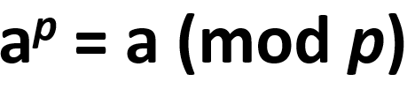

# primality_check_fermat
My code to check if a number is a prime using Fermat's Little Theorem

Let `a` be any integer and `p` be a prime number.

The theorem states that:

If p is a prime, this is true.

If it is not a prime, the probability that this is true is `1/p` since `p` can have `p` many different remainders `(0, 1, 2, ... , p-1)`.

The algorithm returns True if the condition for the theorem is true, and False if the condition is false.

So, even though the algorithm does not guarantee to give a true result whether the number is prime or not, the risk of being mistaken gets lower as the number increases. 

The benefit of this algorithm is that it is significantly faster than other primality checking methods even if it does not guarantee a result.

To be sure of the result, you can change `b` which is the base `a` we were talking about, which is currently set to `2` to `3`, which will square(and lower by a huge margin) the probability of being incorrect.
